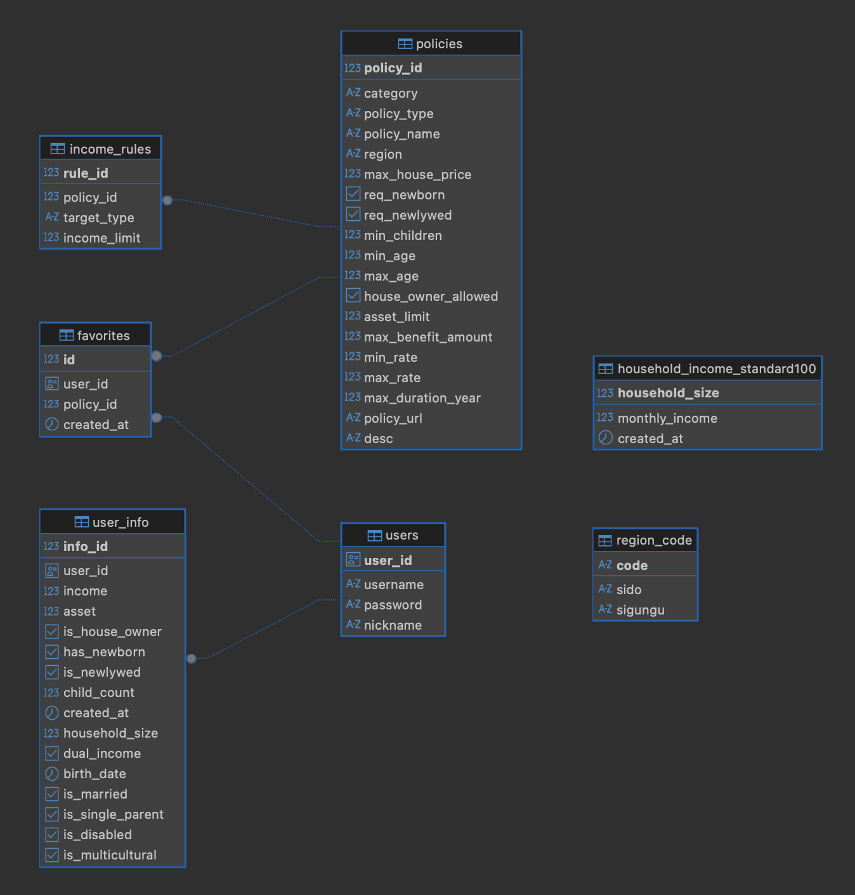

# 🏠 Housing Policy Matcher (공공데이터 기반 주거 정책 추천 시스템)


## 📖 Project Overview
**Housing Policy Matcher**는 국토교통부 아파트 실거래가 API 데이터와 사용자의 자산/소득 정보를 결합하여, **실제로 입주 가능한 아파트와 적용 가능한 주거 정책(대출, 청약 등)을 매칭해주는 서비스**입니다.

단순한 정책 나열이 아니라, 실시간 아파트 가격 변동성을 고려하여 사용자가 **'내가 살고 싶은 집'**을 선택했을 때 지원받을 수 있는 정책만을 필터링하여 제공합니다.

> **개발 기간:** 2025.12 ~ 현재 (진행 중)
> **팀 구성:** Full Stack (2명)

<br/>

## 🛠 Tech Stack & Architecture

### Backend
- **Framework:** Python `FastAPI` (Asynchronous handling)
- **Data Processing:** `NumPy` (거래가 통계 연산 및 필터링)
- **Database:** `PostgreSQL`
- **Validation:** `Pydantic` (Strict Type Checking)

### Frontend
- **Framework:** `React` (Vite)
- **Styling:** `Tailwind CSS`
- **State Management:** React Hooks (`useState`, `useEffect`)

### Data & DevOps
- **Data Source:** 공공데이터포털(국토교통부 아파트매매 실거래자료)
- **Version Control:** Git, GitHub (Monorepo Strategy)

<br/>

## 💡 Key Features & Technical Details

### 1. Data-Driven Policy Filtering Logic
- **실거래가 분석:** 국토부 API를 통해 수집한 최근 3개월간의 아파트 거래 데이터를 `NumPy`를 활용하여 분석(평균가, 최솟값 산출).
- **조건부 필터링:** 사용자의 다차원 정보(소득, 자산, 혼인 여부, 자녀 수 등)와 아파트 시세를 결합하여, 지원 가능한 정책을 $O(N)$ 복잡도로 선별하는 알고리즘 구현.

### 2. RESTful API Design
- **Idempotency(멱등성) 보장:** 사용자 정보 수정 로직에 `PUT` 메서드를 적용하여 리소스의 전체 교체 의미를 명확히 하고 데이터 무결성을 보장.
- **Dependency Injection:** FastAPI의 `Depends`를 활용하여 Query Parameter 검증 로직을 모듈화하고 재사용성을 높임.

### 3. Database Modeling (ERD)
- 정규화(Normalization)를 거친 관계형 데이터베이스 설계.
- `Cascade` 옵션을 활용하여 사용자 탈퇴 시 연관 데이터(즐겨찾기, 상세 정보)의 참조 무결성 유지.



<br/>

## 🚀 Getting Started (How to Run)

이 프로젝트는 **Monorepo** 구조로 되어 있으며, 데이터베이스 초기 세팅이 필요합니다.

### 1. Prerequisites
- Python 3.9+
- Node.js 18+
- PostgreSQL

### 2. Database Setup
PostgreSQL에 데이터베이스를 생성한 후, 제공된 SQL 스크립트를 순서대로 실행해 주세요.
```bash
# 1. 테이블 생성 (Schema)
database/schema.sql

# 2. 기초 데이터 적재 (Seed Data - 정책 및 지역 코드)
database/seed.sql

# 3. Backend (FastAPI)
cd backend
python -m venv venv
source venv/bin/activate  # (Windows: venv\Scripts\activate)
pip install -r requirements.txt

# .env 파일 설정 (DB 정보 및 API Key) 후 실행
uvicorn main:app --reload

# 4. Frontend (React)
cd frontend
npm install
npm run dev

# 📂 Project Structure
housing-policy-recommendation/
├── backend/            # FastAPI Application
│   ├── main.py         # Entry Point
│   ├── models.py       # Pydantic Models
│   └── routers/        # API Routers
├── frontend/           # React Application
│   ├── src/
│   └── public/
├── database/           # DB Scripts
│   ├── schema.sql      # DDL (Create Tables)
│   └── seed.sql        # DML (Insert Initial Data)
└── assets/             # Project Images (ERD)
```